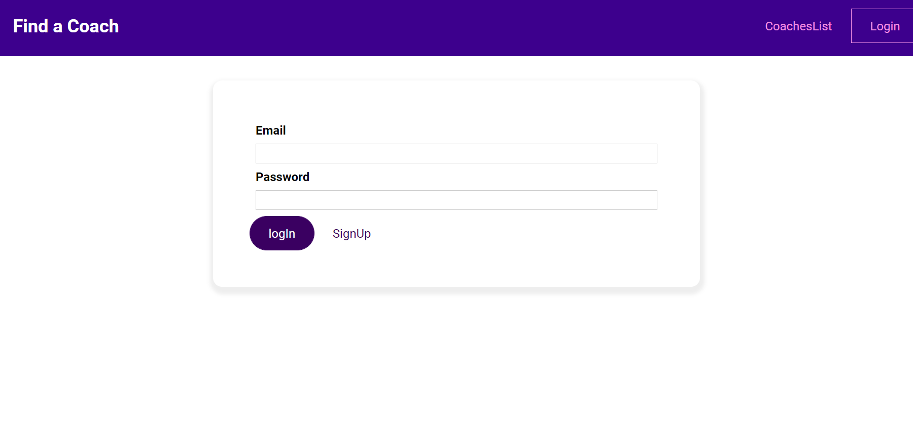
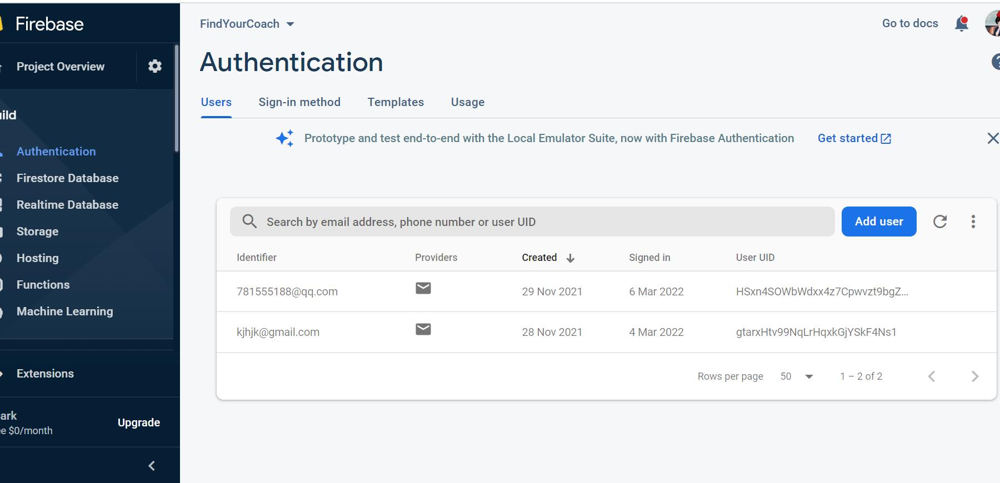
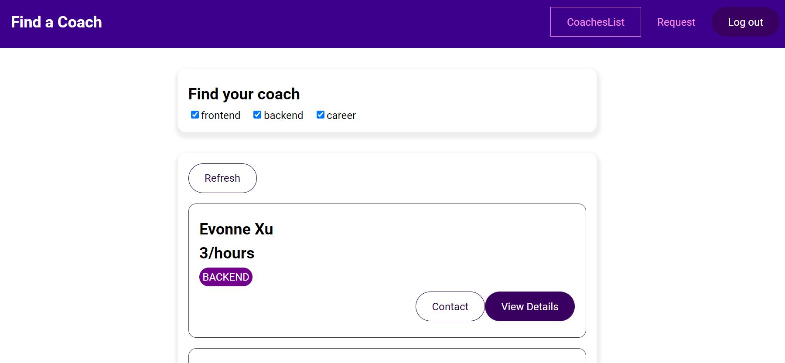
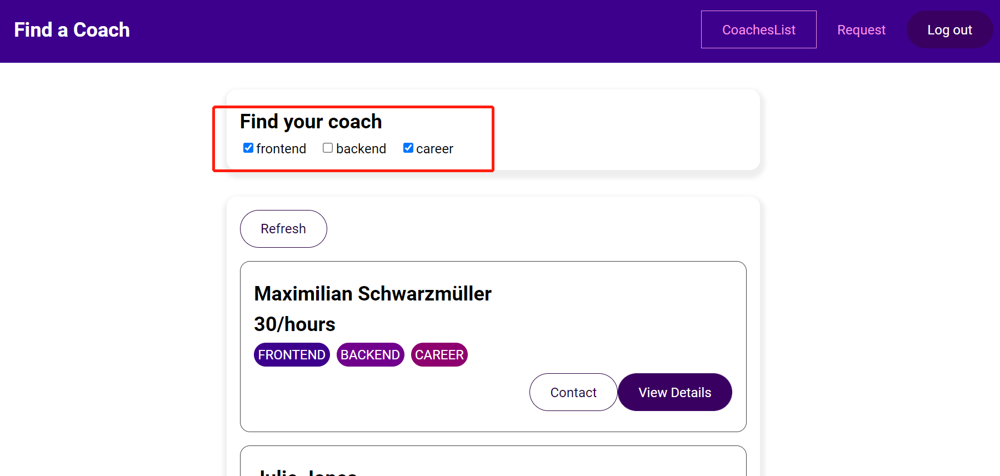
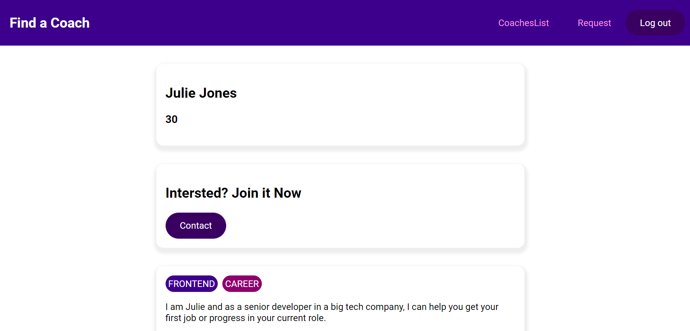
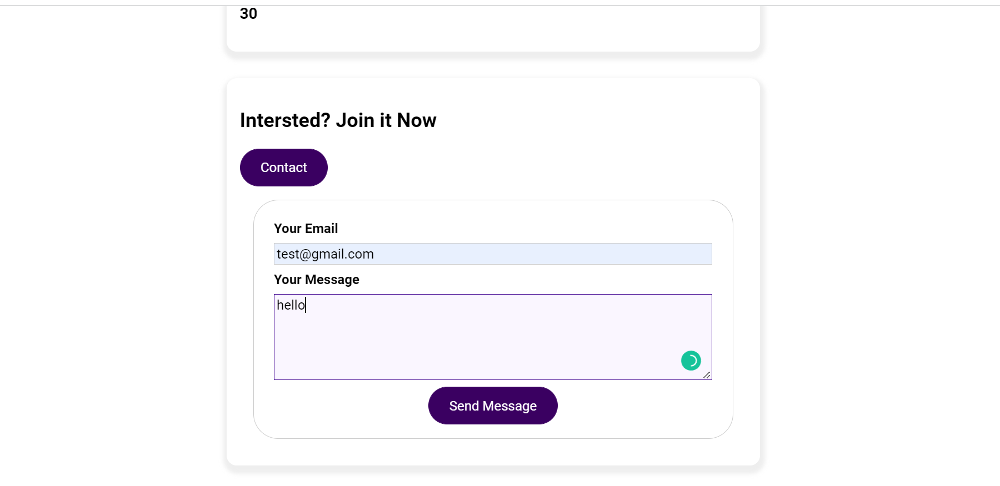
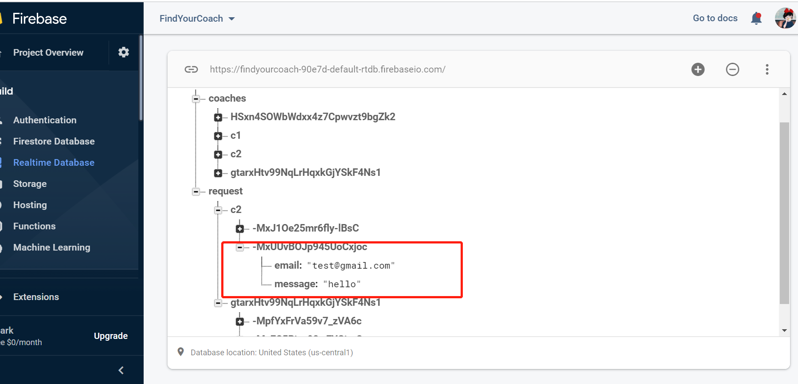
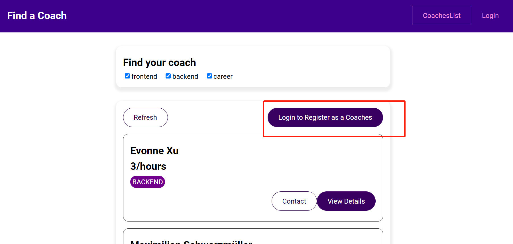
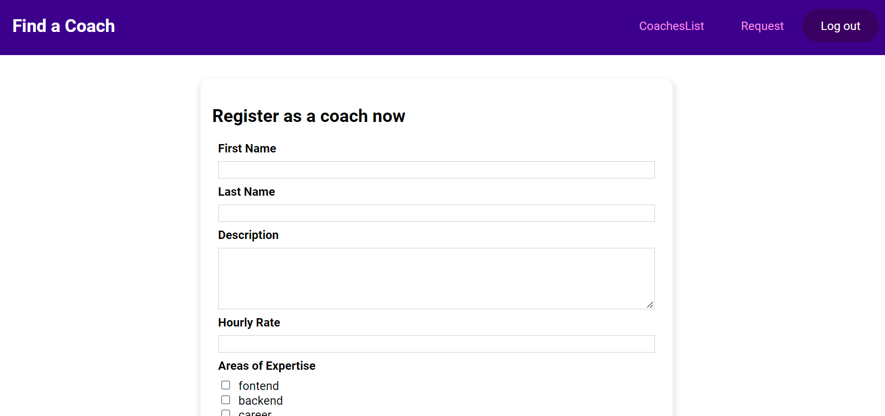
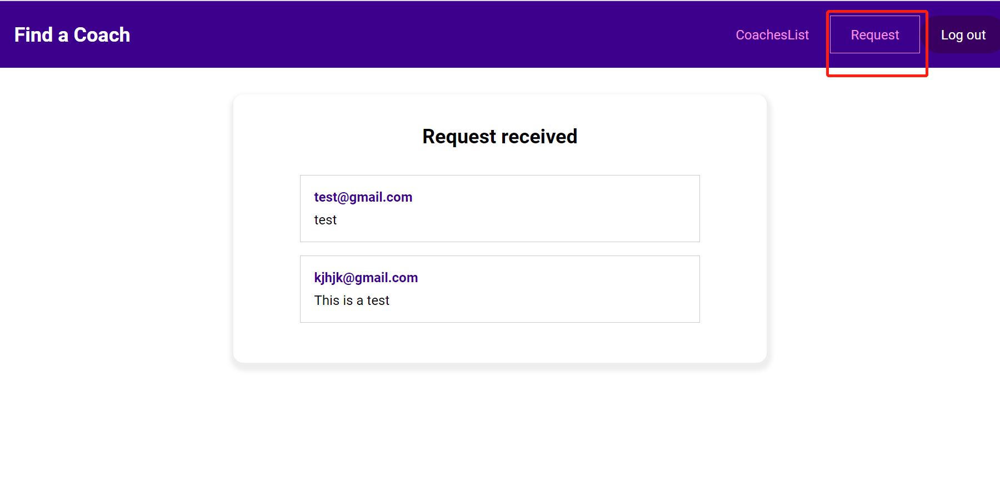

# Find a Coach -- Vue Project

URL: <https://findyourcoach-90e7d.web.app>

基于Vue的web应用程序，提供给访问者普通用户和教师两种权限的注册与登录功能。当身份为普通用户时，可以查看已存在的教师信息并且网站提供教师信息筛选功能，除此之外，还可以通过网站直接联系已注册的教师；当用户身份为教师，拥有普通用户的全部权限，另外还能对收到的信息进行交流回复

后端为Firebase,使用Firebase realtime database存储教师数据，使用Firebase Authenticationf接受token模拟用户登录

1. 登录界面，用户名：781555188@qq.com 密码：123456

FireBase后台用户数据展示

1. 登录成功后，展示为：

3. 用户可以点击对勾可以过滤需要展示的老师

4. 用户点击viewDetail后可以查看教师的详细信息

5. 如果需要contact某个老师，可以点击contact按钮，然后输入你的邮箱和信息.
此时后台的数据库，会更新数据库

6. 你可以注册成为老师，点击这个button即可注册

1. 当你作为老师的身份的登陆时候，可以在你的request中查看你收到的信息

